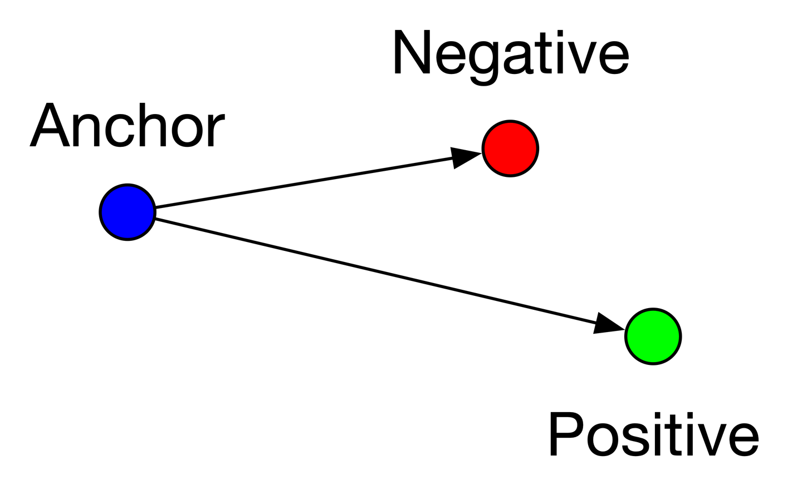
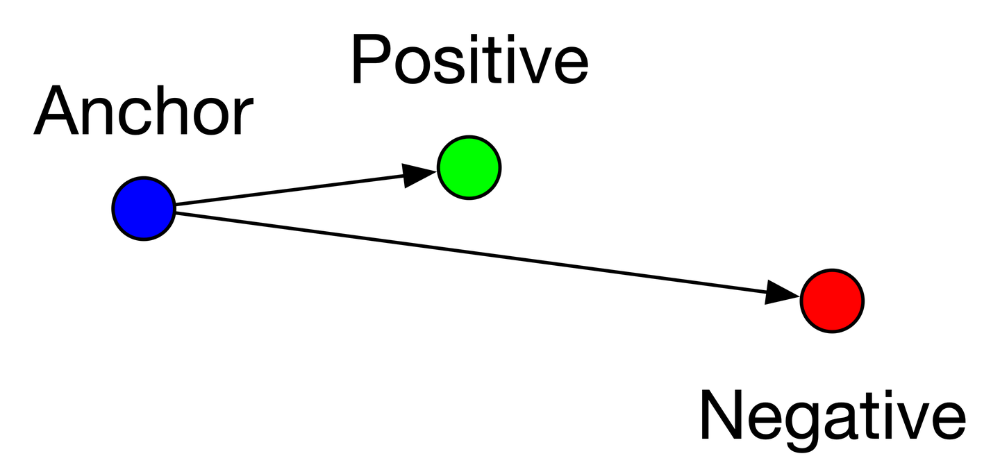
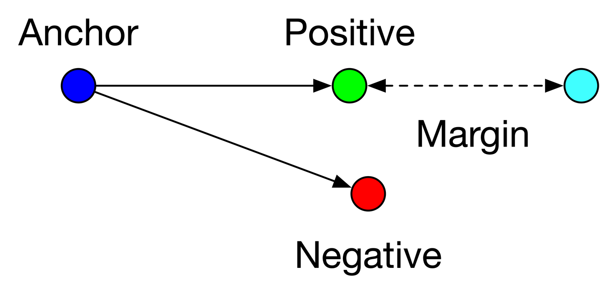
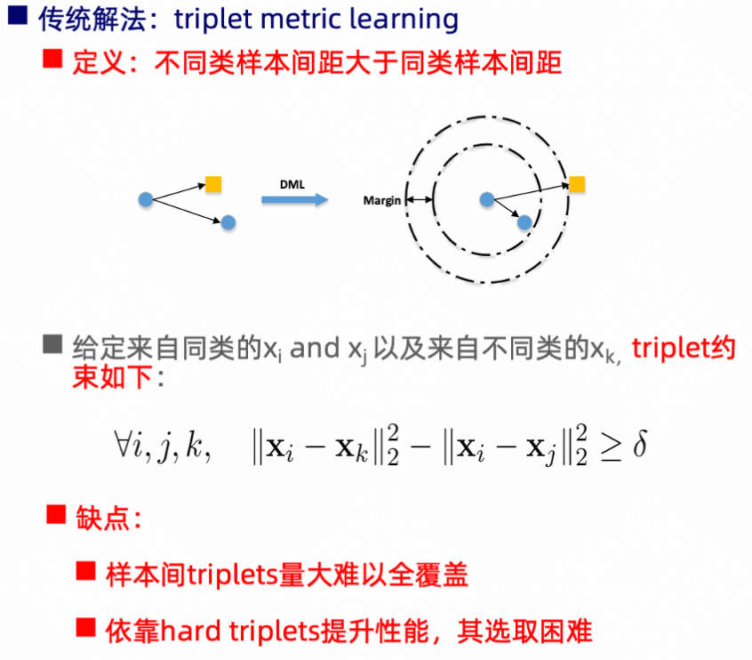

# Loss相关介绍

## [TripletLoss](./triplet_loss.py)

- **hard triplets**: $L > margin$，即 $d(a, n) > d(a, p)$，a和n的距离近，a和p的距离远，这种情况损失最大，需要优化，如下图

- **easy triplets**： $L = 0$，即 $d(a, n) > d(a, p) + margin$，这种情况不需要优化，天然a和p的距离很近，a和n的距离很远，如下图

- **semi-hard triplets**: $L > margin$，即 $d(a, p) + margin > d(a, n) > d(a, p)$，即a和p的距离比a和n的距离近，但是近的不够多，不满足margin，这种情况存在损失，但损失比hard triplets要小，也需要优化，如下图

缺点

## [MultiTaskUncertaintyLoss](./MultiTaskUncertaintyLoss.py)

这个方法的核心思想源于 Alex Kendall 等人在论文 *Multi-Task Learning Using Uncertainty to Weigh Losses for Scene Geometry and Semantics* 中提出的方法。

### 概念

目标是最小化这个总损失函数：

`L_total = (1 / (2 * σ_1²)) * L_1 + (1 / (2 * σ_2²)) * L_2 + log(σ_1) + log(σ_2)`

其中：
*   `L_1`, `L_2` 是两个任务的原始损失
*   `σ_1`, `σ_2` 是两个可学习的参数，代表每个任务的不确定性。

为了在优化时保持数值稳定性，我们通常不直接学习 `σ`，而是学习它的对数方差 `log(σ²)`。这有几个好处：
1.  `log(σ²)` 的取值范围是整个实数域，而 `σ` 必须为正，`σ²` 必须为非负，前者更容易优化。
2.  可以避免计算中的除零或开方等操作。

令 `s = log(σ²)`，则 `σ² = exp(s)`。代入原公式，总损失可以重写为：

`L_total = exp(-s_1) * L_1 + exp(-s_2) * L_2 + s_1 + s_2`
(这里省略了常数系数 0.5 和 `log(2π)`，因为它们不影响梯度)

### 代码输出分析

当你运行这段代码时，你会观察到以下现象：

1.  **损失值的差异**：`Task2 Loss`（高噪声任务）的原始MSE损失会一直显著高于 `Task1 Loss`。
2.  **`log_var` 的变化**：
    *   `model.log_var_task1` 的值会变得很小，甚至可能是负数。
    *   `model.log_var_task2` 的值会逐渐增大。
3.  **权重的动态调整**：
    *   任务1的权重 `exp(-log_var_task1)` 会变得**大于1**。
    *   任务2的权重 `exp(-log_var_task2)` 会变得**远小于1**。

**最终的输出会明确显示**：模型自动学会了给那个难以优化的、噪声很大的任务2分配一个非常低的权重，而把更多的“注意力”（即更高的权重）放在了那个干净、稳定的任务1上。这完美地展示了同方差不确定性如何作为一个**自动化的损失加权机制**来发挥作用。